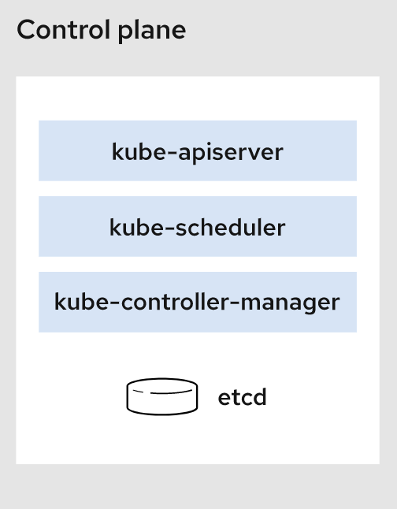
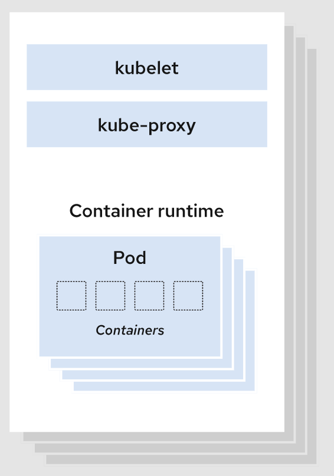
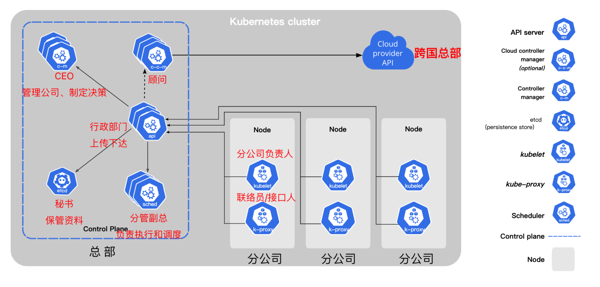

## kubernetes架构

一个Kubernetes集群至少包含一个控制平面(control plane)，以及一个或多个工作节点(worker node)。

- **控制平面(Control Plane)** : 控制平面负责管理工作节点和维护集群状态。所有任务分配都来自于控制平面。
- **工作节点(Worker Node)** : 工作节点负责执行由控制平面分配的请求任务,运行实际的应用和工作负载。

## 控制平面

控制平面组件会为集群做出全局决策，比如资源的调度、检测和响应集群事件。

### kube-apiserver

如果需要与Kubernetes 集群进行交互，就要通过 API。
`apiserver`是 Kubernetes 控制平面的前端，用于处理内部和外部请求。

### kube-scheduler

集群状况是否良好？如果需要创建新的容器，要将它们放在哪里？这些是调度程序需要关注的问题。
`scheduler`调度程序会考虑容器集的资源需求（例如 CPU 或内存）以及集群的运行状况。随后，它会将容器集安排到适当的计算节点。

### etcd

[etcd](https://www.redhat.com/zh/topics/containers/what-is-etcd)是一个键值对数据库，用于存储配置数据和集群状态信息。

### kube-controller-manager

控制器负责实际运行集群，`controller-manager`控制器管理器则是将多个控制器功能合而为一，降低了程序的复杂性。

`controller-manager`包含了这些控制器：

- 节点控制器（Node Controller）：负责在节点出现故障时进行通知和响应
- 任务控制器（Job Controller）：监测代表一次性任务的 Job 对象，然后创建 Pods 来运行这些任务直至完成
- 端点控制器（Endpoints Controller）：填充端点（Endpoints）对象（即加入 Service 与 Pod）
- 服务帐户和令牌控制器（Service Account & Token Controllers）：为新的命名空间创建默认帐户和 API 访问令牌

## Node 组件

节点组件会在每个节点上运行，负责维护运行的 Pod 并提供 Kubernetes 运行环境。

### kubelet

kubelet 会在集群中每个[节点（node）](https://kubernetes.io/zh-cn/docs/concepts/architecture/nodes/)上运行。 它保证[容器（containers）](https://kubernetes.io/zh-cn/docs/concepts/overview/what-is-kubernetes/#why-containers)都运行在 [Pod](https://kubernetes.io/zh-cn/docs/concepts/workloads/pods/) 中。
当控制平面需要在节点中执行某个操作时，kubelet 就会执行该操作。

### kube-proxy

[kube-proxy](https://kubernetes.io/zh-cn/docs/reference/command-line-tools-reference/kube-proxy/) 是集群中每个[节点（node）](https://kubernetes.io/zh-cn/docs/concepts/architecture/nodes/)上运行的网络代理，是实现 Kubernetes [服务（Service）](https://kubernetes.io/zh-cn/docs/concepts/services-networking/service/) 概念的一部分。
kube-proxy 维护节点网络规则和转发流量，实现从集群内部或外部的网络与 Pod 进行网络通信。

### 容器运行时（Container Runtime）

容器运行环境是负责运行容器的软件。
Kubernetes 支持许多容器运行环境，例如 [containerd](https://containerd.io/docs/)、docker或者其他实现了 [Kubernetes CRI (容器运行环境接口)](https://github.com/kubernetes/community/blob/master/contributors/devel/sig-node/container-runtime-interface.md)的容器。

## 组件关系

### cloud-controller-manager

控制平面还包含一个可选组件`cloud-controller-manager`。
云控制器管理器（Cloud Controller Manager）允许你将你的集群连接到云提供商的 API 之上， 并将与该云平台交互的组件同与你的集群交互的组件分离开来。
如果在自己的环境中运行 Kubernetes，或者在本地计算机中运行学习环境， 所部署的集群不需要有云控制器管理器。

参考资料：
[https://kubernetes.io/zh-cn/docs/concepts/overview/components/](https://kubernetes.io/zh-cn/docs/concepts/overview/components/)
[https://www.redhat.com/zh/topics/containers/kubernetes-architecture](https://www.redhat.com/zh/topics/containers/kubernetes-architecture)

