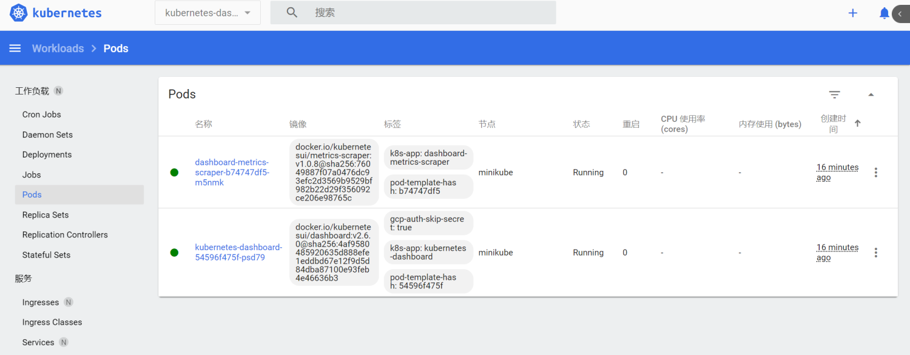

> 1. Minikube是官方文档中的入门工具，但是它的功能有限，不能满足我们的课程要求。
> 2. 后面的内容我们不使用Minikube，本节内容仅用来说明使用Minikube可能遇到的问题。

### Minikube

Minikube是一个可以本地运行的单机版kubernetes,方便我们学习kubernetes和调试程序。
安装Minikube需要使用Docker或虚拟机。推荐使用Docker。

- 运行环境
  - 至少2核
  - 内存不低于2GB
  - 硬盘空闲空间不低于20GB
  - 联网环境
  - Docker（或虚拟机）

---

### Windows下安装

下载Minikube：[https://storage.googleapis.com/minikube/releases/latest/minikube-installer.exe](https://storage.googleapis.com/minikube/releases/latest/minikube-installer.exe)
默认安装路径：`C:\Program Files\Kubernetes\Minikube`<br/>
启动 minikube<br/>

```bash
minikube start --image-mirror-country='cn' --container-runtime=containerd
```
- **`--image-mirror-country='cn'`**

设置使用国内阿里云镜像源

- **`--container-runtime=containerd`**

> Minikube默认安装kubernetes v1.25.0，需要将容器运行时设置为`containerd`
> 运行v1.24 .0及之后版本，都需要此设置。如果不设置会出现错误。

---

```bash
* Microsoft Windows 10 Home 10.0.19042 Build 19042 上的 minikube v1.27.0
! Kubernetes 1.25.0 has a known issue with resolv.conf. minikube is using a workaround that should work for most use cases.
! For more information, see: https://github.com/kubernetes/kubernetes/issues/112135
* 自动选择 docker 驱动。其他选项：hyperv, ssh
* 正在使用镜像存储库 registry.cn-hangzhou.aliyuncs.com/google_containers
* Using Docker Desktop driver with root privileges
* Starting control plane node minikube in cluster minikube
* Pulling base image ...
* Creating docker container (CPUs=2, Memory=2200MB) ...
    > kubeadm.sha256:  64 B / 64 B [-------------------------] 100.00% ? p/s 0s
    > kubectl.sha256:  64 B / 64 B [-------------------------] 100.00% ? p/s 0s
    > kubelet.sha256:  64 B / 64 B [-------------------------] 100.00% ? p/s 0s
    > kubeadm:  41.76 MiB / 41.76 MiB [-------------] 100.00% 4.64 MiB p/s 9.2s
    > kubectl:  42.92 MiB / 42.92 MiB [--------------] 100.00% 3.41 MiB p/s 13s
    > kubelet:  108.93 MiB / 108.93 MiB [------------] 100.00% 6.29 MiB p/s 18s

  - Generating certificates and keys ...
  - Booting up control plane ...
! initialization failed, will try again: wait: /bin/bash -c "sudo env PATH="/var/lib/minikube/binaries/v1.25.0:$PATH" kubeadm init --config /var/tmp/minikube/kubeadm.yaml  --ignore-preflight-errors=DirAvailable--etc-kubernetes-manifests,DirAvailable--var-lib-minikube,DirAvailable--var-lib-minikube-etcd,FileAvailable--etc-kubernetes-manifests-kube-scheduler.yaml,FileAvailable--etc-kubernetes-manifests-kube-apiserver.yaml,FileAvailable--etc-kubernetes-manifests-kube-controller-manager.yaml,FileAvailable--etc-kubernetes-manifests-etcd.yaml,Port-10250,Swap,Mem,SystemVerification,FileContent--proc-sys-net-bridge-bridge-nf-call-iptables": Process exited with status 1
stdout:
[init] Using Kubernetes version: v1.25.0
[preflight] Running pre-flight checks
[preflight] Pulling images required for setting up a Kubernetes cluster
[preflight] This might take a minute or two, depending on the speed of your internet connection
[preflight] You can also perform this action in beforehand using 'kubeadm config images pull'
[certs] Using certificateDir folder "/var/lib/minikube/certs"
[certs] Using existing ca certificate authority
[certs] Using existing apiserver certificate and key on disk
[certs] Generating "apiserver-kubelet-client" certificate and key
[certs] Generating "front-proxy-ca" certificate and key
[certs] Generating "front-proxy-client" certificate and key
[certs] Generating "etcd/ca" certificate and key
[certs] Generating "etcd/server" certificate and key
[certs] etcd/server serving cert is signed for DNS names [localhost minikube] and IPs [192.168.49.2 127.0.0.1 ::1]
[certs] Generating "etcd/peer" certificate and key
[certs] etcd/peer serving cert is signed for DNS names [localhost minikube] and IPs [192.168.49.2 127.0.0.1 ::1]
[certs] Generating "etcd/healthcheck-client" certificate and key
[certs] Generating "apiserver-etcd-client" certificate and key
[certs] Generating "sa" key and public key
[kubeconfig] Using kubeconfig folder "/etc/kubernetes"
[kubeconfig] Writing "admin.conf" kubeconfig file
[kubeconfig] Writing "kubelet.conf" kubeconfig file
[kubeconfig] Writing "controller-manager.conf" kubeconfig file
[kubeconfig] Writing "scheduler.conf" kubeconfig file
[kubelet-start] Writing kubelet environment file with flags to file "/var/lib/kubelet/kubeadm-flags.env"
[kubelet-start] Writing kubelet configuration to file "/var/lib/kubelet/config.yaml"
[kubelet-start] Starting the kubelet
[control-plane] Using manifest folder "/etc/kubernetes/manifests"
[control-plane] Creating static Pod manifest for "kube-apiserver"
[control-plane] Creating static Pod manifest for "kube-controller-manager"
[control-plane] Creating static Pod manifest for "kube-scheduler"
[etcd] Creating static Pod manifest for local etcd in "/etc/kubernetes/manifests"
[wait-control-plane] Waiting for the kubelet to boot up the control plane as static Pods from directory "/etc/kubernetes/manifests". This can take up to 4m0s
[kubelet-check] Initial timeout of 40s passed.

Unfortunately, an error has occurred:
        timed out waiting for the condition

This error is likely caused by:
        - The kubelet is not running
        - The kubelet is unhealthy due to a misconfiguration of the node in some way (required cgroups disabled)

If you are on a systemd-powered system, you can try to troubleshoot the error with the following commands:
        - 'systemctl status kubelet'
        - 'journalctl -xeu kubelet'

Additionally, a control plane component may have crashed or exited when started by the container runtime.
To troubleshoot, list all containers using your preferred container runtimes CLI.
Here is one example how you may list all running Kubernetes containers by using crictl:
        - 'crictl --runtime-endpoint unix:///var/run/cri-dockerd.sock ps -a | grep kube | grep -v pause'
        Once you have found the failing container, you can inspect its logs with:
        - 'crictl --runtime-endpoint unix:///var/run/cri-dockerd.sock logs CONTAINERID'

stderr:
W0921 08:05:08.887894    1828 initconfiguration.go:119] Usage of CRI endpoints without URL scheme is deprecated and can cause kubelet errors in the future. Automatically prepending scheme "unix" to the "criSocket" with value "/var/run/cri-dockerd.sock". Please update your configuration!
        [WARNING Swap]: swap is enabled; production deployments should disable swap unless testing the NodeSwap feature gate of the kubelet
        [WARNING Service-Kubelet]: kubelet service is not enabled, please run 'systemctl enable kubelet.service'
error execution phase wait-control-plane: couldn't initialize a Kubernetes cluster
To see the stack trace of this error execute with --v=5 or higher
```

如果要运行其他kubernetes版本，使用以下命令

```bash
minikube start --image-mirror-country='cn' --kubernetes-version=v1.23.0
```

停止、启动、删除minikube

```bash
minikube stop
minikube start
minikube delete --all
```

### Kubectl


[kubectl](https://kubernetes.io/docs/reference/kubectl/kubectl/) 是一个kubernetes命令行工具。
kubectl 使用 Kubernetes API 与 Kubernetes 集群的[控制面](https://kubernetes.io/zh-cn/docs/reference/glossary/?all=true#term-control-plane)进行通信，可以使用 kubectl 部署应用程序、检查和管理群集资源以及查看日志。

---

查看节点状态：

```bash
kubectl get node
```

查看所有POD：

```bash
kubectl get pod -A
```

minikube ssh`进入容器，查看kubelet状态

```bash
systemctl status kubelet
```

### 安装Dashboard

```bash
minikube dashboard --url --port=63373
```

不设置`--port`端口是随机的，每次启动可能会变化。<br/>
在浏览器访问（命令行退出后无法访问）： [http://127.0.0.1:63373/api/v1/namespaces/kubernetes-dashboard/services/http:kubernetes-dashboard:/proxy/](http://127.0.0.1:63373/api/v1/namespaces/kubernetes-dashboard/services/http:kubernetes-dashboard:/proxy/)


参考文档：
[https://minikube.sigs.k8s.io/docs/start/](https://minikube.sigs.k8s.io/docs/start/)
[https://kubernetes.io/zh-cn/docs/reference/kubectl/](https://kubernetes.io/zh-cn/docs/reference/kubectl/)

