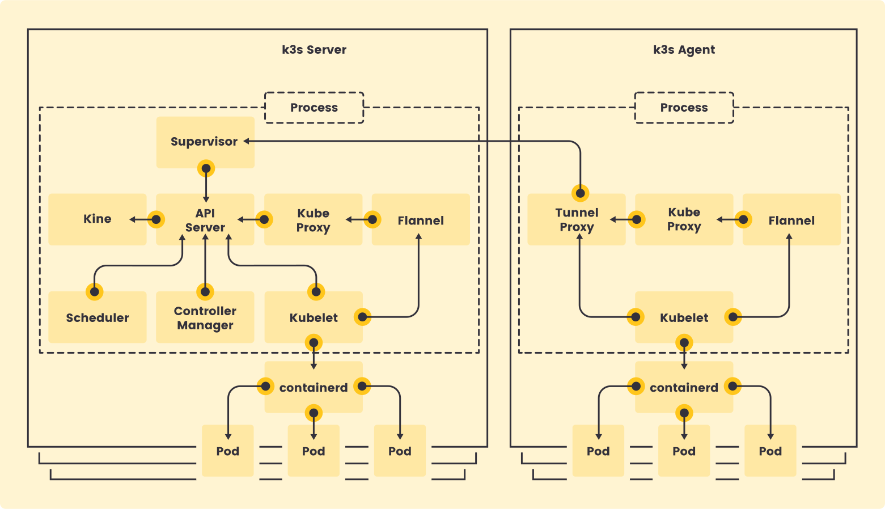

> 提示：
> 1.本课程基于kubernetes V1.25版本。
> 2.从V1.24开始，kubernetes默认容器运行时使用containerd，不再使用docker。

## 为什么使用K3s

K3s 是一个轻量级的、完全兼容的 Kubernetes 发行版本。非常适合初学者。
K3s将所有 Kubernetes 控制平面组件都封装在单个二进制文件和进程中，文件大小<100M,占用资源更小，且包含了kubernetes运行所需要的部分外部依赖和本地存储提供程序。
K3s提供了离线安装包，安装起来非常方便，可以避免安装过程中遇到各种网络资源访问问题。
K3s特别适用于边缘计算、物联网、嵌入式和ARM移动端场景。

> 提示：
> K3s完全兼容kubernetes，二者的操作是一样的，使用k3s完全满足我们学习kubernetes的要求，课程的最后，我们再使用kubeadm安装一个完整的集群。

## 离线安装K3s集群

K3s集群分为`k3s Server`(控制平面)和`k3s Agent`(工作节点)。所有的组件都打包在单个二进制文件中。


### 运行环境

- 最低运行要求
  
  - 内存: 512MB   /   CPU: 1 核心
- K3s版本：**v1.25.0+k3s1**
- 集群规划

| 主机名 | IP地址 | 配置 | 系统 | IP网络 |
| --- | --- | --- | --- | --- |
| k8s - master | 192.168.56.109 | 2核/2G内存/20G硬盘 | CentOS 7.9.2009 | 互  联  网:NAT网络/内部网络: Host-only |
| k8s-worker1 | 192.168.56.111 | 同上 | 同上 | 同上 |
| k8s-worker2 | 192.168.56.112 | 同上 | 同上 | 同上 |

### 1.准备工作

需要在每台机器上执行如下命令：

- 关闭防火墙
- 设置selinux(需要联网)

```bash
systemctl disable firewalld --now
```

```bash
yum install -y container-selinux selinux-policy-base
yum install -y https://rpm.rancher.io/k3s/latest/common/centos/7/noarch/k3s-selinux-0.2-1.el7_8.noarch.rpm
```

### 2.下载安装包

下载安装脚本`install.sh`：[https://get.k3s.io/](https://get.k3s.io/)
下载`k3s`二进制文件：[k3s](https://github.com/k3s-io/k3s/releases/download/v1.25.0%2Bk3s1/k3s)
下载必要的**image**：[离线安装需要的image文件](https://github.com/k3s-io/k3s/releases/download/v1.25.0%2Bk3s1/k3s-airgap-images-amd64.tar.gz)

> 这些文件都可以在github仓库中获取：[https://github.com/k3s-io/k3s](https://github.com/k3s-io/k3s)

---

### 3.执行安装脚本

1.将`k3s`二进制文件移动到`/usr/local/bin`目录，并添加执行权限

```bash
mv k3s /usr/local/bin
chmod +x /usr/local/bin/k3s
```

2.将镜像移动到`/var/lib/rancher/k3s/agent/images/`目录（无需解压）

```bash
mkdir -p /var/lib/rancher/k3s/agent/images/
cp ./k3s-airgap-images-amd64.tar.gz /var/lib/rancher/k3s/agent/images/
```

- 在`k8s-master`节点执行：

```bash
#修改权限
chmod +x install.sh
#离线安装
INSTALL_K3S_SKIP_DOWNLOAD=true ./install.sh
#安装完成后，查看节点状态
kubectl get node
#查看token
cat /var/lib/rancher/k3s/server/node-token
#K10c4b79481685b50e4bca2513078f4e83b62d1d0b5f133a8a668b65c8f9249c53e::server:bf7b63be7f3471838cbafa12c1a1964d
```

- 在`k8s-worker1`和`k8s-worker2`节点执行

```bash
INSTALL_K3S_SKIP_DOWNLOAD=true \
K3S_URL=https://192.168.56.109:6443 \
K3S_TOKEN=K1012bdc3ffe7a5d89ecb125e56c38f9fe84a9f9aed6db605f7698fa744f2f2f12f::server:fdf33f4921dd607cadf2ae3c8eaf6ad9 \
./install.sh
```

## 排查错误

如果安装或启动不成功，可能有以下几个原因：

> 1. 时间不统一
> 2. `IP`有冲突，请为每个主机分配不同的IP
> 3. 主机名(**hostname**)重复，请为每个主机设置不同的主机名
> 4. 网卡的MAC有冲突，复制虚拟机时，请为所有网卡重新生产MAC地址

参考文档：
[https://k3s.io/](https://k3s.io/)
[https://rancher.com/docs/k3s/latest/en/](https://rancher.com/docs/k3s/latest/en/)
[https://rancher.com/docs/k3s/latest/en/quick-start/](https://rancher.com/docs/k3s/latest/en/quick-start/)
[https://rancher.com/docs/k3s/latest/en/installation/airgap/](https://rancher.com/docs/k3s/latest/en/installation/airgap/)

