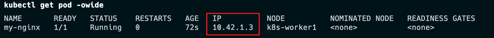
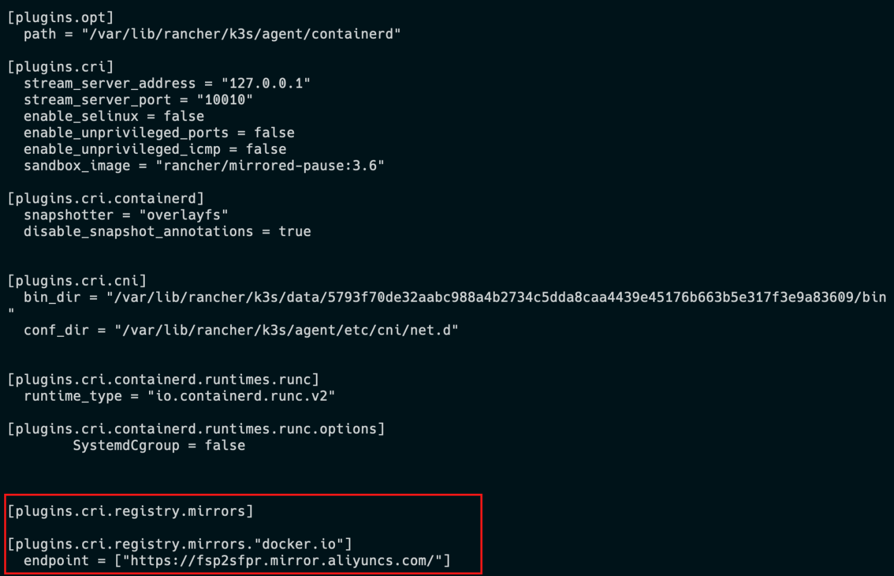

## Pod

**Pod** 是包含一个或多个容器的容器组，是 Kubernetes 中创建和管理的最小对象。
Pod 有以下特点：

- Pod是kubernetes中**最小的调度单位（**原子单元**）**，Kubernetes直接管理Pod而不是容器。
- 同一个Pod中的容器总是会被自动安排到集群中的**同一节点**（物理机或虚拟机）上，并且**一起调度**。
- Pod可以理解为运行特定应用的“逻辑主机”，这些容器共享存储、网络和配置声明(如资源限制)。
- 每个 Pod 有唯一的 IP 地址。**IP地址分配给Pod**，在同一个 Pod 内，所有容器共享一个 IP 地址和端口空间，Pod 内的容器可以使用`localhost`互相通信。

---

例如，你可能有一个容器，为共享卷中的文件提供 Web 服务器支持，以及一个单独的 "边车 (sidercar)" 容器负责从远端更新这些文件，如下图所示：


## 创建和管理Pod

```bash
kubectl run mynginx --image=nginx
# 查看Pod
kubectl get pod
# 描述
kubectl describe pod mynginx
# 查看Pod的运行日志
kubectl logs mynginx

# 显示pod的IP和运行节点信息
kubectl get pod -owide
# 使用Pod的ip+pod里面运行容器的端口
curl 10.42.1.3

#在容器中执行
kubectl exec mynginx -it -- /bin/bash

kubectl get po --watch
# -it 交互模式 
# --rm 退出后删除容器，多用于执行一次性任务或使用客户端
kubectl run mynginx --image=nginx -it --rm -- /bin/bash 

# 删除
kubectl delete pod mynginx
# 强制删除
kubectl delete pod mynginx --force
```



## 镜像加速

由于kubernetes从`V1.24`版本开始默认使用`containerd`，需要修改`containerd`的配置文件，才能让Pod的镜像使用镜像加速器。
配置文件路径一般为`/etc/containerd/config.toml`，详见[阿里云镜像加速](https://help.aliyun.com/document_detail/60750.html)。

#### 在K3s中配置镜像仓库

K3s 会自动生成containerd的配置文件`/var/lib/rancher/k3s/agent/etc/containerd/config.toml`,不要直接修改这个文件，k3s重启后修改会丢失。
为了简化配置，K3s 通过`/etc/rancher/k3s/registries.yaml`文件来配置镜像仓库，K3s会在启动时检查这个文件是否存在。
我们需要在每个节点上新建`/etc/rancher/k3s/registries.yaml`文件，配置内容如下：

```yaml
mirrors:
  docker.io:
    endpoint:
      - "https://fsp2sfpr.mirror.aliyuncs.com/"
```

重启每个节点

```bash
systemctl restart k3s
systemctl restart k3s-agent
```

查看配置是否生效。

```bash
cat /var/lib/rancher/k3s/agent/etc/containerd/config.toml
```



## 容器与镜像

#### 容器运行时接口（CRI）

Kubelet运行在每个节点(Node)上,用于管理和维护Pod和容器的状态。
容器运行时接口（CRI）是kubelet 和容器运行时之间通信的主要协议。它将 Kubelet 与容器运行时解耦，理论上，实现了CRI接口的容器引擎，都可以作为kubernetes的容器运行时。

> Docker没有实现（CRI）接口，Kubernetes使用`dockershim`来兼容docker。
> 自V1.24版本起，Dockershim 已从 Kubernetes 项目中移除。

`crictl`是一个兼容CRI的容器运行时命令，他的用法跟`docker`命令一样，可以用来检查和调试底层的运行时容器。

```yaml
crictl pull mysql:5.7-debian
crictl images
```

在一些局域网环境下，我们没法通过互联网拉取镜像，可以手动的导出、导入镜像。
`crictl`命令没有导出、导入镜像的功能。
需要使用`ctr`命令导出、导入镜像，它是`containerd`的命令行接口。

---

- 从`docker`导出镜像再导入到`containerd`中

```bash
docker pull alpine:3.16
docker save alpine:3.16 > alpine.tar

#kubernetes使用的镜像都在k8s.io命名空间中
ctr -n k8s.io images import alpine.tar
```

- 从`containerd`导出、导入镜像

```yaml
#导出镜像
ctr -n k8s.io images export mysql.tar docker.io/library/mysql:5.7-debian --platform linux/amd64
#导入镜像
ctr -n k8s.io images import mysql.tar
```

参考文档：
[https://kubernetes.io/zh-cn/docs/concepts/workloads/pods/](https://kubernetes.io/zh-cn/docs/concepts/workloads/pods/)
[https://kubernetes.io/docs/reference/generated/kubectl/kubectl-commands](https://kubernetes.io/docs/reference/generated/kubectl/kubectl-commands)
[https://kubernetes.io/zh-cn/docs/tasks/debug/debug-cluster/crictl/](https://kubernetes.io/zh-cn/docs/tasks/debug/debug-cluster/crictl/)
[https://docs.k3s.io/installation/private-registry](https://docs.k3s.io/installation/private-registry)

