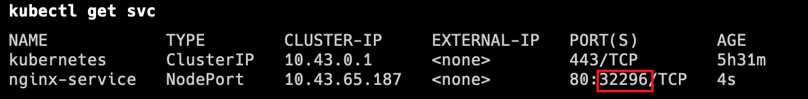
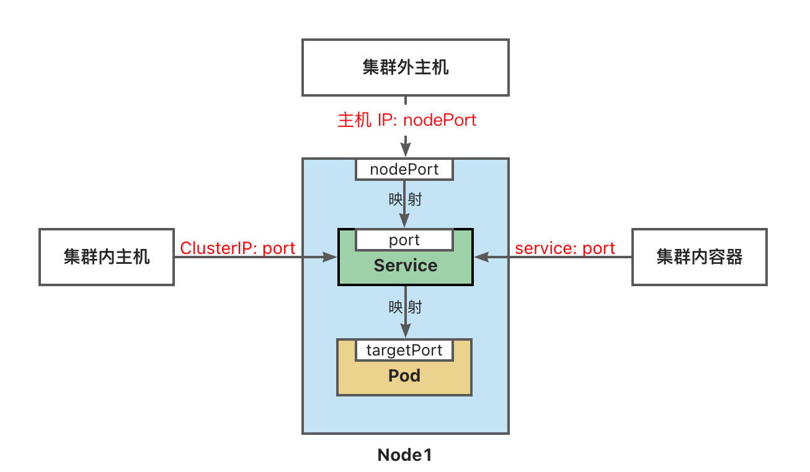

Service将运行在一组 [Pods](https://kubernetes.io/zh-cn/docs/concepts/workloads/pods/) 上的应用程序公开为网络服务的抽象方法。
Service为一组 Pod 提供相同的 DNS 名，并且在它们之间进行负载均衡。
Kubernetes 为 Pod 提供分配了IP 地址，但IP地址可能会发生变化。
集群内的容器可以通过service名称访问服务，而不需要担心Pod的IP发生变化。

---

Kubernetes Service 定义了这样一种抽象：
逻辑上的一组可以互相替换的 Pod，通常称为微服务。
Service 对应的 Pod 集合通常是通过[选择算符](https://kubernetes.io/zh-cn/docs/concepts/overview/working-with-objects/labels/)来确定的。
举个例子，在一个Service中运行了3个nginx的副本。这些副本是可互换的，我们不需要关心它们调用了哪个nginx，也不需要关注 Pod的运行状态，只需要调用这个服务就可以了。

## 创建Service对象

### ServiceType 取值

- ClusterIP：将服务公开在集群内部。kubernetes会给服务分配一个集群内部的 IP，集群内的所有主机都可以通过这个Cluster-IP访问服务。集群内部的Pod可以通过service名称访问服务。
- [NodePort](https://kubernetes.io/zh-cn/docs/concepts/services-networking/service/#type-nodeport)：通过每个节点的主机IP 和静态端口（NodePort）暴露服务。 集群的外部主机可以使用节点IP和NodePort访问服务。
- [ExternalName](https://kubernetes.io/zh-cn/docs/concepts/services-networking/service/#externalname)：将集群外部的网络引入集群内部。
- [LoadBalancer](https://kubernetes.io/zh-cn/docs/concepts/services-networking/service/#loadbalancer)：使用云提供商的负载均衡器向外部暴露服务。

```bash
# port是service访问端口,target-port是Pod端口
# 二者通常是一样的
kubectl expose deployment/nginx-deployment \
--name=nginx-service --type=ClusterIP --port=80 --target-port=80
```

```bash
# 随机产生主机端口
kubectl expose deployment/nginx-deployment \
--name=nginx-service2 --type=NodePort --port=8080 --target-port=80
```



### 访问Service

外部主机访问：192.168.56.109:32296。

> 1.NodePort端口是随机的，范围为:30000-32767。
> 2.集群中每一个主机节点的NodePort端口都可以访问。
> 3.如果需要指定端口，不想随机产生，需要使用配置文件来声明。



```bash
#集群内访问
curl 10.43.65.187:80

#容器内访问
kubectl run nginx-test --image=nginx:1.22 -it --rm -- sh
#
curl nginx-service:80
```

参考文档：
[https://kubernetes.io/zh-cn/docs/concepts/services-networking/service/](https://kubernetes.io/zh-cn/docs/concepts/services-networking/service/)
[https://kubernetes.io/zh-cn/docs/tutorials/stateless-application/expose-external-ip-address/](https://kubernetes.io/zh-cn/docs/tutorials/stateless-application/expose-external-ip-address/)

