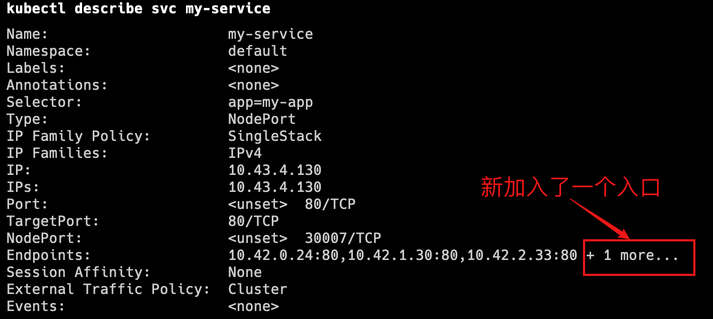

**金丝雀部署(canary deployment)也被称为灰度发布。**
早期，工人下矿井之前会放入一只金丝雀检测井下是否存在有毒气体。
采用金丝雀部署，你可以在生产环境的基础设施中小范围的部署新的应用代码。
一旦应用签署发布，只有少数用户被路由到它，最大限度的降低影响。
如果没有错误发生，则将新版本逐渐推广到整个基础设施。

---


### 部署过程


#### 部署第一个版本

发布v1版本的应用，镜像使用`nginx:1.22`,数量为 3。

- **创建Namespace**

[Namespace配置模版](https://kubernetes.io/docs/tasks/administer-cluster/namespaces/#creating-a-new-namespace)

- **创建Deployment**

[Deployment配置模版](https://kubernetes.io/docs/concepts/workloads/controllers/deployment/#creating-a-deployment)

- **创建外部访问的Service**

[Service配置模版](https://kubernetes.io/docs/concepts/services-networking/service/#type-nodeport)

```yaml
apiVersion: v1
kind: Namespace
metadata:
  name: dev
---
apiVersion: apps/v1
kind: Deployment
metadata:
  name: nginx-deployment-v1
  namespace: dev
  labels:
    app: nginx-deployment-v1
spec:
  replicas: 3
  selector:
    matchLabels: # 跟template.metadata.labels一致
      app: nginx
  template:
    metadata:
      labels:
        app: nginx
    spec:
      containers:
      - name: nginx
        image: nginx:1.22
        ports:
        - containerPort: 80
---
apiVersion: v1
kind: Service
metadata:
  name: canary-demo
  namespace: dev
spec:
  type: NodePort
  selector: # 更Deployment中的selector一致
    app: nginx
  ports:
      # By default and for convenience, the `targetPort` is set to the same value as the `port` field.
    - port: 80
      targetPort: 80
      # Optional field
      # By default and for convenience, the Kubernetes control plane will allocate a port from a range (default: 30000-32767)
      nodePort: 30008
```

#### 创建Canary Deployment

发布新版本的应用，镜像使用docker/getting-started，数量为 1。

```yaml
apiVersion: apps/v1
kind: Deployment
metadata:
  name: nginx-deployment-canary
  namespace: dev
  labels:
    app: nginx-deployment-canary
spec:
  replicas: 1
  selector:
    matchLabels: # 跟template.metadata.labels一致
      app: nginx
  template:
    metadata:
      labels:
        app: nginx
        track: canary
    spec:
      containers:
        - name: new-nginx
          image: docker/getting-started
          ports:
            - containerPort: 80
```

#### 分配流量

查看服务`kubectl describe svc canary-demo --namespace=dev`


- 调整比例

待稳定运行一段时间后，扩大试用范围，将部署的v2版本数量调整为3，v1和v2的数量都是3个。

```yaml
kubectl scale deployment/deploy-v2-canary --replicas=3 -n=dev
```

- 下线旧版本

最后下线所有v1版本，所有服务升级为v2版本。

```yaml
kubectl scale deployment/deploy-v1 --replicas=0 -n=dev
```

### 清空环境

使用`namespace`可以方便的清空环境：

```yaml
kubectl delete all --all -n=dev
```

---

> **局限性**
> 按照 Kubernetes 默认支持的这种方式进行金丝雀发布，有一定的局限性：
> 
> - 不能根据用户注册时间、地区等请求中的内容属性进行流量分配
> - 同一个用户如果多次调用该 Service，有可能第一次请求到了旧版本的 Pod，第二次请求到了新版本的 Pod

在 Kubernetes 中不能解决上述局限性的原因是：Kubernetes Service 只在 TCP 层面解决负载均衡的问题，并不对请求响应的消息内容做任何解析和识别。如果想要更完善地实现金丝雀发布，可以考虑Istio灰度发布。

参考文档：
[https://www.infoq.cn/article/lei4vsfpiw5a6en-aso4](https://www.infoq.cn/article/lei4vsfpiw5a6en-aso4)
[https://kuboard.cn/learning/k8s-intermediate/workload/wl-deployment/canary.html](https://kuboard.cn/learning/k8s-intermediate/workload/wl-deployment/canary.html)

