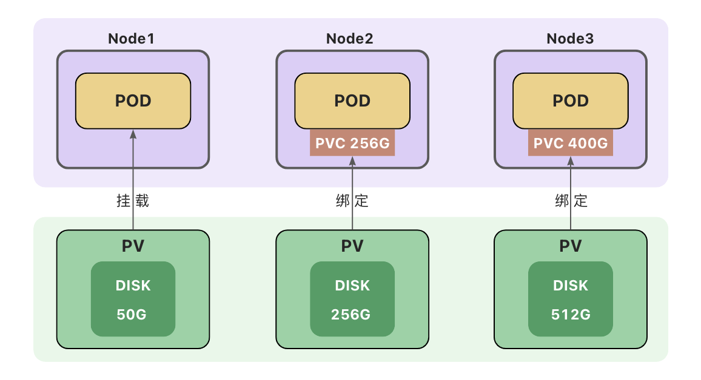

- **持久卷(Persistent Volume)：删除Pod后，卷不会被删除**
  
  - 本地存储
    
    - [hostPath](https://kubernetes.io/zh-cn/docs/concepts/storage/volumes/#hostpath) - 节点主机上的目录或文件
      (仅供单节点测试使用；多节点集群请用**local**卷代替)
    - [local](https://kubernetes.io/zh-cn/docs/concepts/storage/volumes/#local) - 节点上挂载的本地存储设备(不支持动态创建卷)
  - 网络存储
    
    - [NFS](https://kubernetes.io/zh-cn/docs/concepts/storage/volumes/#nfs) - 网络文件系统 (NFS)
  - 分布式存储
    
    - Ceph([cephfs](https://kubernetes.io/zh-cn/docs/concepts/storage/volumes/#cephfs)文件存储、[rbd](https://kubernetes.io/zh-cn/docs/concepts/storage/volumes/#rbd)块存储)

### 持久卷(PV)和**持久卷声明(PVC)**

**持久卷（PersistentVolume，PV）** 是集群中的一块存储。可以理解为一块虚拟硬盘。
持久卷可以由管理员事先创建， 或者使用[存储类（Storage Class）](https://kubernetes.io/zh-cn/docs/concepts/storage/storage-classes/)根据用户请求来动态创建。
持久卷属于集群的公共资源，并不属于某个`namespace`;

**持久卷声明（PersistentVolumeClaim，PVC）** 表达的是用户对存储的请求。
PVC声明好比申请单，它更贴近云服务的使用场景，使用资源先申请，便于统计和计费。
Pod 将 PVC 声明当做存储卷来使用，PVC 可以请求指定容量的存储空间和[访问模式](https://kubernetes.io/zh-cn/docs/concepts/storage/persistent-volumes/#access-modes) 。PVC对象是带有`namespace`的。

---

### 创建持久卷（PV）

创建持久卷(PV)是服务端的行为，通常集群管理员会提前创建一些常用规格的持久卷以备使用。
`hostPath`仅供单节点测试使用，当Pod被重新创建时，可能会被调度到与原先不同的节点上，导致新的Pod没有数据。多节点集群使用本地存储，可以使用`local`卷
创建`local`类型的持久卷，需要先创建存储类(StorageClass)。
[本地存储类示例](https://kubernetes.io/zh-cn/docs/concepts/storage/storage-classes/#local)

```yaml
# 创建本地存储类
apiVersion: storage.k8s.io/v1
kind: StorageClass
metadata:
  name: local-storage
provisioner: kubernetes.io/no-provisioner
volumeBindingMode: Immediate
```

`local`卷不支持动态创建，必须手动创建持久卷(PV)。
创建`local`类型的持久卷，**必须**设置`nodeAffinity`(节点亲和性)。
调度器使用`nodeAffinity`信息来将使用`local`卷的 Pod 调度到持久卷所在的节点上，不会出现Pod被调度到别的节点上的情况。

> 注意：`local`卷也存在自身的问题，当Pod所在节点上的存储出现故障或者整个节点不可用时，Pod和卷都会失效，仍然会丢失数据，因此最安全的做法还是将数据存储到集群之外的存储或云存储上。

- **创建PV**

[PV示例](https://kubernetes.io/zh-cn/docs/tasks/configure-pod-container/configure-persistent-volume-storage/#create-a-pv)/[local卷示例](https://kubernetes.io/zh-cn/docs/concepts/storage/volumes/#local)

```yaml
apiVersion: v1
kind: PersistentVolume
metadata:
  name: local-pv-1
spec:
  capacity:
    storage: 4Gi
  volumeMode: Filesystem
  accessModes:
  - ReadWriteOnce
  persistentVolumeReclaimPolicy: Delete
  storageClassName: local-storage #通过指定存储类来设置卷的类型
  local:
    path: /mnt/disks/ssd1
  nodeAffinity:
    required:
      nodeSelectorTerms:
      - matchExpressions:
        - key: kubernetes.io/hostname
          operator: In
          values:
          - k8s-worker1
```

### 创建持久卷声明(PVC)

持久卷声明(PVC)是用户端的行为,用户在创建Pod时，无法知道集群中PV的状态(名称、容量、是否可用等)，用户也无需关心这些内容，只需要在声明中提出申请，集群会自动匹配符合需求的持久卷(PV)。
Pod使用持久卷声明(PVC)作为存储卷。

[PVC示例](https://kubernetes.io/zh-cn/docs/tasks/configure-pod-container/configure-persistent-volume-storage/#create-a-pvc)

```yaml
apiVersion: v1
kind: PersistentVolumeClaim
metadata:
  name: local-pv-claim
spec:
  storageClassName: local-storage # 与PV中的storageClassName一致
  accessModes:
    - ReadWriteOnce
  resources:
    requests:
      storage: 3Gi
```

---

### 使用PVC作为卷

Pod 的配置文件指定了 PersistentVolumeClaim，但没有指定 PersistentVolume。
对 Pod 而言，PersistentVolumeClaim 就是一个存储卷。
[PVC卷示例](https://kubernetes.io/zh-cn/docs/concepts/storage/persistent-volumes/#claims-as-volumes)

```yaml
apiVersion: v1
kind: Pod
metadata:
  name: mysql-pod
spec:
  containers:
    - name: mysql
      image: mysql:5.7
      env:
        - name: MYSQL_ROOT_PASSWORD
          value: "123456"
      ports:
        - containerPort: 3306
      volumeMounts:
        - mountPath: /var/lib/mysql #容器中的目录
          name: local-mysql-data
  volumes:
    - name: local-mysql-data
      persistentVolumeClaim:
        claimName: local-pv-claim
```

#### 绑定

创建持久卷声明(PVC)之后，集群会查找满足要求的持久卷(PV)，将 PVC 绑定到该 PV上。
PVC与PV之间的绑定是一对一的映射关系，绑定具有排他性，一旦绑定关系建立，该PV无法被其他PVC使用。
PVC可能会匹配到比声明容量大的持久卷，但是不会匹配比声明容量小的持久卷。
例如，即使集群上存在多个 50 G大小的 PV ，他们加起来的容量大于100G，也无法匹配100 G大小的 PVC。
找不到满足要求的 PV ，PVC会无限期地处于未绑定状态(Pending) , 直到出现了满足要求的 PV时，PVC才会被绑定。

#### 访问模式

- **ReadWriteOnce**
  - 卷可以被一个节点以读写方式挂载，并允许同一节点上的多个 Pod 访问。
- **ReadOnlyMany**
  - 卷可以被多个节点以只读方式挂载。
- **ReadWriteMany**
  - 卷可以被多个节点以读写方式挂载。
- **ReadWriteOncePod**
  - 卷可以被单个 Pod 以读写方式挂载。 集群中只有一个 Pod 可以读取或写入该 PVC。
  - 只支持 CSI 卷以及需要 Kubernetes 1.22 以上版本。

---

#### 卷的状态

- Available（可用）-- 卷是一个空闲资源，尚未绑定到任何；
- Bound（已绑定）-- 该卷已经绑定到某个持久卷声明上；
- Released（已释放）-- 所绑定的声明已被删除，但是资源尚未被集群回收；
- Failed（失败）-- 卷的自动回收操作失败。

---

#### 卷模式

卷模式(volumeMode)是一个可选参数。
针对 PV 持久卷，Kubernetes 支持两种卷模式（volumeModes）：

- Filesystem（文件系统）

默认的卷模式。

- Block（块）

将卷作为原始块设备来使用。


参考文档：
[https://kubernetes.io/zh-cn/docs/concepts/storage/volumes/](https://kubernetes.io/zh-cn/docs/concepts/storage/volumes/)
[https://kubernetes.io/zh-cn/docs/concepts/storage/persistent-volumes/](https://kubernetes.io/zh-cn/docs/concepts/storage/persistent-volumes/)
[https://kubernetes.io/zh-cn/docs/tasks/configure-pod-container/configure-persistent-volume-storage/](https://kubernetes.io/zh-cn/docs/tasks/configure-pod-container/configure-persistent-volume-storage/)

