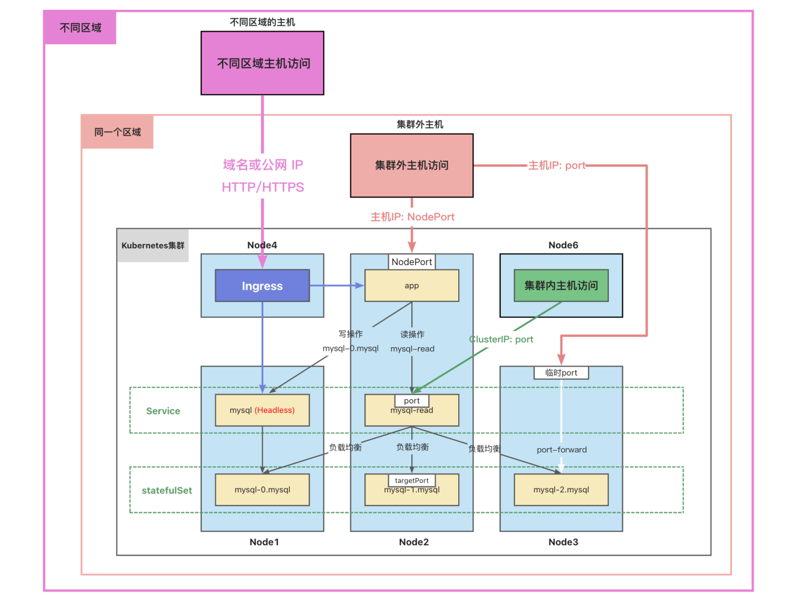

通常，集群中的数据库不直接对外访问。
但是，有时候我们需要图形化工具连接到数据库进行操作或者调试。
我们可以使用端口转发来访问集群中的应用。
`kubectl port-forward`可以将本地端口的连接转发给容器。
此命令在前台运行，命令终止后，转发会话将结束。

---

> 这种类型的连接对数据库调试很有用。

```bash
#主机端口在前，容器端口在后
#如果主机有多个IP，需要指定IP，如不指定IP，默认为127.0.0.1
kubectl port-forward pods/mysql-0 --address=192.168.56.109 33060:3306
```

### 网络访问

- 容器中应用访问数据库：
  - 读操作：mysql-read:3306
  - 写操作：mysql-0.mysql:3306
- 集群中的Node访问：
  - ClusterIP：port
- 集群外的主机访问：
  - 主机IP：nodePort



参考资料：
[https://kubernetes.io/zh-cn/docs/tasks/run-application/run-replicated-stateful-application/](https://kubernetes.io/zh-cn/docs/tasks/run-application/run-replicated-stateful-application/)
[https://kubernetes.io/zh-cn/docs/concepts/services-networking/dns-pod-service/](https://kubernetes.io/zh-cn/docs/concepts/services-networking/dns-pod-service/)
[https://kubernetes.io/zh-cn/docs/tasks/access-application-cluster/port-forward-access-application-cluster/](https://kubernetes.io/zh-cn/docs/tasks/access-application-cluster/port-forward-access-application-cluster/)

