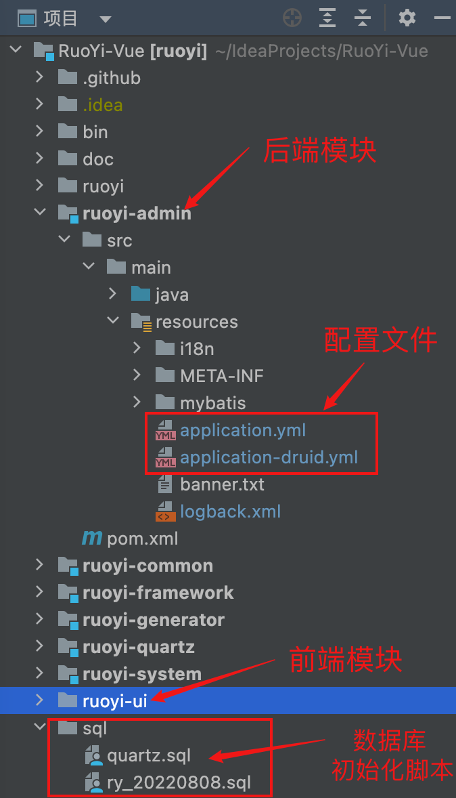

**RuoYi-Vue简介**
**RuoYi-Vue** 是一个Java Web后台管理系统，包含用户、角色、权限、部门、菜单、日志管理等功能。
他的架构比较有代表性，后端基于**Spring Boot**,前端使用**Vue**。
以分离版若依作为部署对象，更贴近我们的工作场景。
支持集群，支持多数据源，支持分布式事务。

---

**源码下载：**

- 文档地址：[https://doc.ruoyi.vip/ruoyi-vue/](https://doc.ruoyi.vip/ruoyi-vue/)
- 代码下载：[https://gitee.com/y_project/RuoYi-Vue](https://gitee.com/y_project/RuoYi-Vue)
- 部署手册：[https://doc.ruoyi.vip/ruoyi-vue/document/hjbs.html](https://doc.ruoyi.vip/ruoyi-vue/document/hjbs.html)

---

**运行环境：**

- JDK >= 1.8
- MySQL >= 5.7
- Maven >= 3.0
- Node >= 12
- Redis >= 3

---

**部署步骤：**

```
- 部署Redis
              - 部署MySQL
              - 构建后端镜像
              - 构建前端镜像
              - 搭建私有镜像仓库
              - 部署后端
              - 部署前端
```

**源码结构：** <br/>


