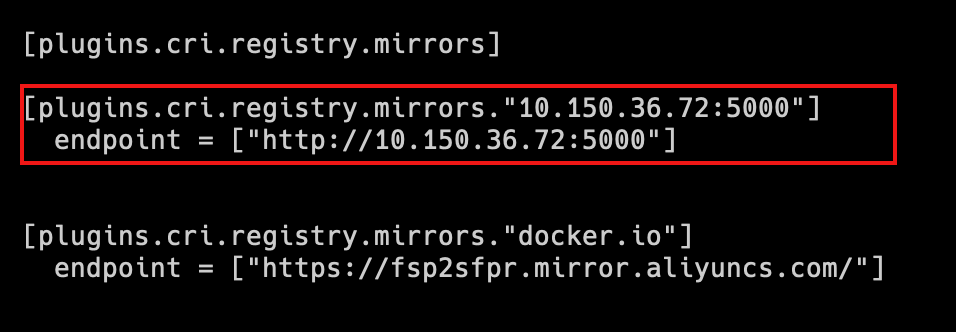

#### 搭建私有镜像仓库

通常，公司的项目不允许推送到互联网上，因此我们需要搭建私有镜像仓库。
搭建私有镜像仓库我们可以使用[**registry**](https://hub.docker.com/_/registry)**或[**harbor**](https://hub.docker.com/r/bitnami/harbor-portal)**。

```bash
docker run -d -p 5000:5000 --restart always --name registry registry:2
```

将镜像推送到私有镜像仓库

```nginx
#推送后端镜像
#修改镜像tag
docker tag ruoyi-admin:v3.8 10.150.36.72:5000/ruoyi-admin:v3.8
#推送到私有镜像仓库中
docker push 10.150.36.72:5000/ruoyi-admin:v3.8    

#推送前端镜像
#修改镜像tag
docker tag ruoyi-ui:v3.8 10.150.36.72:5000/ruoyi-ui:v3.8
#推送到私有镜像仓库中
docker push 10.150.36.72:5000/ruoyi-ui:v3.8
```

> **push/pull**命令默认使用HTTPS协议推送或拉取镜像，但是我们搭建的registry使用HTTP协议，因此会报下面的错误：
> 

解决这个问题，需要修改`/etc/docker/daemon.json`，加入下面的配置

```json
"insecure-registries": ["10.150.36.72:5000"]
```

重启docker之后，再次推送就可以了。
在kubernetes集群中，使用`crictl pull 10.150.36.72:5000/ruoyi-admin:v3.8`命令拉取镜像也会报同样的错误。
我们需要修改`containerd`的配置文件，K3s提供了一种简单的方法。
在**每一台**机器上修改`/etc/rancher/k3s/registries.yaml`

```yaml
mirrors:
  docker.io:
    endpoint:
      - "https://fsp2sfpr.mirror.aliyuncs.com/"
  # 加入下面的配置
  10.150.36.72:5000:
    endpoint: 
      #使用http协议
      - "http://10.150.36.72:5000"
```

然后重启每一个节点

```bash
#重启master组件
systemctl restart k3s
#重启node组件
systemctl restart k3s-agent
```

查看containerd的配置文件

```bash
cat  /var/lib/rancher/k3s/agent/etc/containerd/config.toml
```


配置完成后，就可以成功拉取镜像了。

