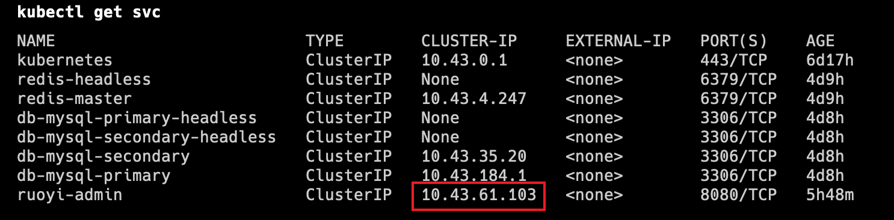

Redis和MySQL的**DNS**地址

```
#Redis can be accessed via port 6379 on the following DNS name from within your cluster:
redis-master.default.svc.cluster.local

#MySQL DNS NAME
Primary: 
	db-mysql-primary.default.svc.cluster.local:3306
Secondary: 
	db-mysql-secondary.default.svc.cluster.local:3306
```

#### 使用配置文件生成configMap

```yaml
# 数据源配置
spring:
  # redis 配置
  redis:
    # 地址
    host: redis-master
    # 端口，默认为6379
    port: 6379
    # 数据库索引
    database: 0
    # 密码
    password: 123456
    # 连接超时时间
    timeout: 10s
    lettuce:
      pool:
        # 连接池中的最小空闲连接
        min-idle: 0
        # 连接池中的最大空闲连接
        max-idle: 8
        # 连接池的最大数据库连接数
        max-active: 8
        # #连接池最大阻塞等待时间（使用负值表示没有限制）
        max-wait: -1ms
  datasource:
    type: com.alibaba.druid.pool.DruidDataSource
    driverClassName: com.mysql.cj.jdbc.Driver
    druid:
      # 主库数据源
      master:
        url: jdbc:mysql://db-mysql-primary:3306/ry-vue?useUnicode=true&characterEncoding=utf8&zeroDateTimeBehavior=convertToNull&useSSL=true&serverTimezone=GMT%2B8
        username: root
        password: 123456
      # 从库数据源
      slave:
        # 从数据源开关/默认关闭
        enabled: true
        url: jdbc:mysql://db-mysql-secondary:3306/ry-vue?useUnicode=true&characterEncoding=utf8&zeroDateTimeBehavior=convertToNull&useSSL=true&serverTimezone=GMT%2B8
        username: root
        password: 123456
      # 初始连接数
      initialSize: 5
      # 最小连接池数量
      minIdle: 10
      # 最大连接池数量
      maxActive: 20
      # 配置获取连接等待超时的时间
      maxWait: 60000
      # 配置间隔多久才进行一次检测，检测需要关闭的空闲连接，单位是毫秒
      timeBetweenEvictionRunsMillis: 60000
      # 配置一个连接在池中最小生存的时间，单位是毫秒
      minEvictableIdleTimeMillis: 300000
      # 配置一个连接在池中最大生存的时间，单位是毫秒
      maxEvictableIdleTimeMillis: 900000
      # 配置检测连接是否有效
      validationQuery: SELECT 1 FROM DUAL
      testWhileIdle: true
      testOnBorrow: false
      testOnReturn: false
      webStatFilter:
        enabled: true
      statViewServlet:
        enabled: true
        # 设置白名单，不填则允许所有访问
        allow:
        url-pattern: /druid/*
        # 控制台管理用户名和密码
        login-username: ruoyi
        login-password: 123456
      filter:
        stat:
          enabled: true
          # 慢SQL记录
          log-slow-sql: true
          slow-sql-millis: 1000
          merge-sql: true
        wall:
          config:
            multi-statement-allow: true
```

创建configMap

```bash
kubectl create configmap ruoyi-admin-config --from-file=/home/app/application-k8s.yaml
kubectl describe configmap/ruoyi-admin-config
```

#### 部署后台应用

[Deployment配置模版](https://kubernetes.io/docs/concepts/workloads/controllers/deployment/#creating-a-deployment)**/**[Service配置模版](https://kubernetes.io/docs/concepts/services-networking/service/#nodeport-custom-port)

> spring boot 加载配置文件的最高优先级是项目根路径下的 **`config`** 子目录，打包的时候指定的项目根目录是`/app/ruoyi`，所以可以将**configMap**中的配置文件挂载到容器中的`/app/ruoyi/config`目录中

```yaml
apiVersion: apps/v1
kind: Deployment
metadata:
  name: ruoyi-admin
  labels:
    app: ruoyi-admin
spec:
  replicas: 1
  selector:
    matchLabels:
      app: ruoyi-admin
  template:
    metadata:
      labels:
        app: ruoyi-admin
    spec:
      containers:
        - name: ruoyi-admin
          image: 10.150.36.72:5000/ruoyi-admin:v3.8
          ports:
            - containerPort: 8080
          volumeMounts:
            # springBoot启动时，在jar包所在位置的config目录下查找配置文件
            # jar包所在的位置就是dockerfile中WORKDIR定义的目录，即/app/ruoyi
            - mountPath: /app/ruoyi/config
              name: config
          # 使用application-k8s.yaml作为配置文件
          # 启动命令如下: java -jar ruoyi-admin.jar --spring.profiles.active=k8s
          args: ["--spring.profiles.active=k8s"]
      volumes:
        - name: config
          configMap:
            name: ruoyi-admin-config
---
apiVersion: v1
kind: Service
metadata:
  name: ruoyi-admin
spec:
  type: ClusterIP
  selector:
    app: ruoyi-admin
  ports:
    - port: 8080
      targetPort: 8080
```

查看service

测试一下：`curl 10.43.61.103:8080`

参考文档：
[http://doc.ruoyi.vip/ruoyi-vue/document/hjbs.html](http://doc.ruoyi.vip/ruoyi-vue/document/hjbs.html)

