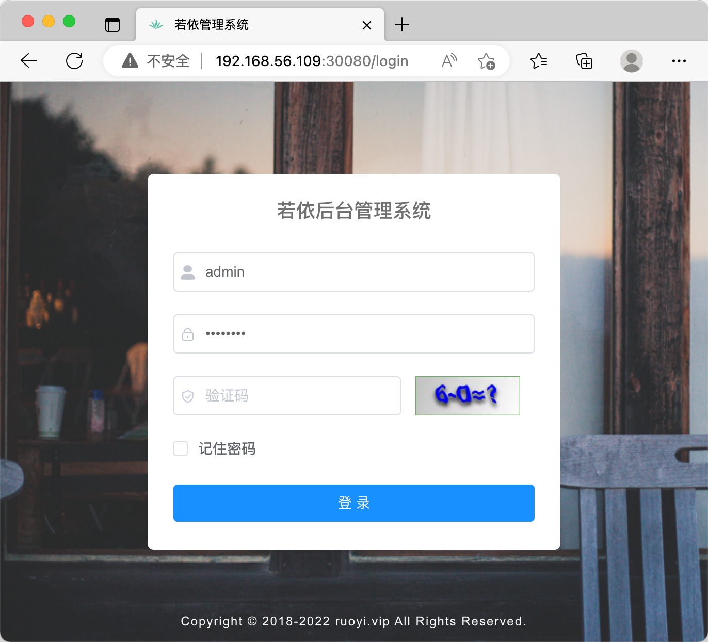

#### nginx配置文件

```nginx
server {
    listen       80;
    server_name  localhost;
    charset utf-8;

    location / {
        # dockerfile中WORKDIR目录
        root   /app/ruoyi-ui;
        try_files $uri $uri/ /index.html;
        index  index.html index.htm;
    }

    location /prod-api/ {
        proxy_set_header Host $http_host;
        proxy_set_header X-Real-IP $remote_addr;
        proxy_set_header REMOTE-HOST $remote_addr;
        proxy_set_header X-Forwarded-For $proxy_add_x_forwarded_for;
        # 后端service的DNS
        proxy_pass http://ruoyi-admin:8080/;
    }

    error_page   500 502 503 504  /50x.html;
    location = /50x.html {
        root   html;
    }
}
```

创建configMap

```bash
kubectl create configmap ruoyi-ui-config --from-file=/home/app/conf/nginx.conf 
kubectl describe configmap/ruoyi-ui-config
```

#### kubernetes资源清单

```yaml
apiVersion: apps/v1
kind: Deployment
metadata:
  name: ruoyi-ui
  labels:
    app: ruoyi-ui
spec:
  replicas: 1
  selector:
    matchLabels:
      app: ruoyi-ui
  template:
    metadata:
      labels:
        app: ruoyi-ui
    spec:
      containers:
        - name: ruoyi-ui
          image: 10.150.36.72:5000/ruoyi-ui:v3.8
          ports:
            - containerPort: 80
          volumeMounts:
            - mountPath: /etc/nginx/conf.d
              name: config
      volumes:
        - name: config
          configMap:
            name: ruoyi-ui-config
            items:
              - key: nginx.conf
                path: default.conf
---
apiVersion: v1
kind: Service
metadata:
  name: ruoyi-ui
spec:
  type: NodePort
  selector:
    app: ruoyi-ui
  ports:
    - port: 80
      targetPort: 80
      nodePort: 30080
```

浏览器访问: [http://192.168.56.109:30080/](http://192.168.56.109:30080/)


参考文档：
[http://doc.ruoyi.vip/ruoyi-vue/document/hjbs.html](http://doc.ruoyi.vip/ruoyi-vue/document/hjbs.html)

