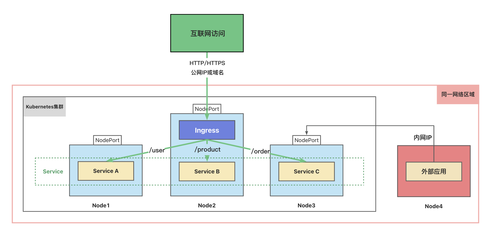

## Ingress(入口)



如果将应用发布为NodePort类型的Service，那么可以通过集群内的任意一台主机的端口访问服务。
当集群位于公有云或私有云上时，要从互联网进行访问，需要使用公网IP或者域名，公网IP是相对稀缺的资源，不可能给所有主机都分配公网IP，并且随着公开的服务变多，众多的端口也变得难以管理。
面对这种情况，我们可以使用Ingress。

**Ingress 可实现：**

- URL路由规则配置
- 负载均衡、流量分割、流量限制
- HTTPS配置
- 基于名字的虚拟托管

创建 Ingress 资源，需要先部署 Ingress 控制器，例如 [ingress-nginx](https://kubernetes.github.io/ingress-nginx/deploy/)。
不同控制器用法和配置是不一样的。
K3s自带来一个基于[Traefik](https://doc.traefik.io/traefik/providers/kubernetes-ingress/)的Ingress控制器，因此我们可以直接创建Ingress资源，无需再安装ingress控制器了。

> **注意：**[Ingress](https://kubernetes.io/docs/reference/generated/kubernetes-api/v1.25/#ingress-v1beta1-networking-k8s-io) 只能公开HTTP 和 HTTPS 类型的服务到互联网。
> 公开其他类型的服务，需要使用[NodePort](https://kubernetes.io/zh-cn/docs/concepts/services-networking/service/#type-nodeport)或[LoadBalancer](https://kubernetes.io/zh-cn/docs/concepts/services-networking/service/#loadbalancer)类型的Service。

## 创建Ingress

[Ingress配置示例](https://kubernetes.io/zh-cn/docs/concepts/services-networking/ingress/#the-ingress-resource)

```yaml
apiVersion: networking.k8s.io/v1
kind: Ingress
metadata:
  name: ruoyi-ingress
spec:
  rules:
    - http:
        paths:
          - path: /
            pathType: Prefix
            backend:
              service:
                name: ruoyi-ui
                port:
                  number: 80
```

> 注意：这里的**path**，需要跟ruoyi-ui使用的nginx.conf中的**location**一致，不然会报错。

```bash
kubectl get ingress
kubectl describe ingress
```


所有服务都通过公网IP或域名的**80**端口访问。

### 路径类型

Ingress 中的每个路径必须设置路径类型(Path Type),当前支持的路径类型有三种：
`Exact`：精确匹配 URL 路径。区分大小写。
`Prefix`：URL 路径前缀匹配。区分大小写。并且对路径中的元素逐个完成。
_(说明：/foo/bar 匹配 /foo/bar/baz, 但不匹配 /foo/barbaz。)_
`ImplementationSpecific`:对于这种路径类型，匹配方法取决于 IngressClass定义的处理逻辑。

### 主机名匹配

[主机名匹配示例](https://kubernetes.io/zh-cn/docs/concepts/services-networking/ingress/#hostname-wildcards)

```yaml
apiVersion: networking.k8s.io/v1
kind: Ingress
metadata:
  name: ruoyi-ingress
spec:
  rules:
    #类似于nginx的虚拟主机配置
    - host: "front.ruoyi.com"
      http:
        paths:
          - pathType: Prefix
            path: "/"
            backend:
              service:
                name: ruoyi-ui
                port:
                  number: 80
    - host: "backend.ruoyi.com"
      http:
        paths:
          - pathType: Prefix
            path: "/"
            backend:
              service:
                name: ruoyi-admin
                port:
                  number: 8080
```

在`/etc/hosts`中添加2条记录：
<br/>
打开[http://front.rouyi.com/](http://front.rouyi.com/)和[http://backend.ruoyi.com/](http://backend.ruoyi.com/)分别访问前后端。


参考文档：
[https://kubernetes.io/zh-cn/docs/concepts/services-networking/ingress/](https://kubernetes.io/zh-cn/docs/concepts/services-networking/ingress/#the-ingress-resource)

