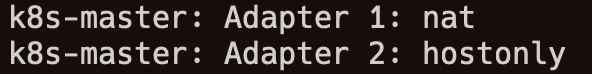

### 1.准备工作

- **Vagrant 2.3.4**

下载地址：[https://developer.hashicorp.com/vagrant/downloads](https://developer.hashicorp.com/vagrant/downloads)

- **VirtualBox 6.1.40**

下载地址：[https://www.virtualbox.org/wiki/Download_Old_Builds_6_1](https://www.virtualbox.org/wiki/Download_Old_Builds_6_1)

> **注意：**
> 
> 1. 在Windows下，启动Vagrant前请先关闭“Hyper-V”，“虚拟机平台”和“适用于Linux的Windows子系统”,虚拟机安装完成后可根据需要自行开启。
> 2. 不要使用 VirtualBox 7.0，Vagrant目前支持还不是很好。

### 2.Vagrant介绍

**Vagrant**是一个虚拟机管理工具，可以通过配置文件，批量、自动化的创建虚拟机，并提供一致性环境。
**Vagrant**不提供虚拟化，需要配合VirtualBox或VMware使用。
**Vagrant**使用box镜像创建虚拟机，box类似于docker image，box是提供一个预先配置好的环境，开箱即用。
使用Vagrant创建虚拟机非常简单：

```ruby
# 下载ubuntu 22.04的box文件到本地，并自动生成Vagrantfile
vagrant init ubuntu/jammy64
# 一键创建和启动虚拟机
vagrant up
```

Vagrant默认从[HashiCorp's Vagrant Cloud box catalog](https://vagrantcloud.com/boxes/search)下载镜像，由于国内网络的原因，下载速度非常慢，并且它不像dockerHub，国内有整站的镜像。
好在Ubuntu官方下载中心会发布基于ubuntu的box镜像(仅支持virtualbox)，因此我们可以从ubuntu的国内镜像中心下载。

```ruby
# vagrant init boxname url
vagrant init ubuntu/jammy64 
        \https://mirrors.tuna.tsinghua.edu.cn/ubuntu-cloud-images/jammy/current/jammy-server-cloudimg-amd64-vagrant.box
```

### 3.创建k3s集群

用户名：`root`   密码：`123456`

| **主机名** | **IP地址**    | **类型**               |
| ---------- | ------------- | ---------------------- |
| k3s-server | 192.168.56.10 | Control Plane 控制平台 |
| k3s-agent1 | 192.168.56.11 | Node节点               |
| k3s-agent2 | 192.168.56.12 | Node节点               |

仓库地址：https://gitee.com/jeff-qiu/k8s-2hours<br/>
启动目录：[vagrant-all/vagrant-k3s](https://gitee.com/jeff-qiu/k8s-2hours/tree/master/vagrant-all/vagrant-k3s)

- `bootstrap.sh`  系统设置脚本
- `Vagrantfile`  Vagrant配置文件

将代码下载到本地，在启动目录运行下面的命令创建虚拟机并自动部署k3s集群

```bash
vagrant up
```

k3s安装脚本和容器镜像均使用阿里云镜像仓库，避免网速不佳或无法下载的问题。

### 4.创建kubernetes集群(使用kubeadm)

用户名：`root`   密码：`123456`

| **主机名**  | **IP地址**    | **类型**               |
| ----------- | ------------- | ---------------------- |
| k8s-master  | 192.168.56.20 | Control Plane 控制平台 |
| k8s-worker1 | 192.168.56.21 | Node节点               |
| k8s-worker2 | 192.168.56.22 | Node节点               |

仓库地址：https://gitee.com/jeff-qiu/k8s-2hours<br/>
启动目录：[vagrant-all/vagrant-k8s](https://gitee.com/jeff-qiu/k8s-2hours/tree/master/vagrant-all/vagrant-k8s)

- `bootstrap.sh`    通用设置脚本(修改系统配置、使用阿里云镜像仓库、安装依赖)
- `kubeadm-init.sh`  kubeadmin初始化控制平面脚本
- `Vagrantfile`  Vagrant创配置文件

将代码下载到本地，在启动目录运行下面的命令创建虚拟机并使用kubeadm自动部署kubernetes集群

```bash
vagrant up
```

可以在`Vagrantfile`中修改下面的变量来选择kubernetes版本,支持 v1.24.0 或更高版本，其他版本未经测试。

```
# kubernetes版本号
$kube_version   = "1.26.0"
```

kubeadm安装过程均使用国内镜像站，避免网速不佳或无法下载的问题。

### 5.创建kubernetes集群(使用kainstall)

> **注意：**
> 
> 1. kainstall由第三方进行维护，具体使用说明请参考：地址：[lework/kainstall(GitHub)](https://github.com/lework/kainstall)

用户名：`root`   密码：`123456`

| **主机名**        | **IP地址**    | **类型**               |
| ----------------- | ------------- | ---------------------- |
| k8s-master-node-1 | 192.168.56.30 | Control Plane 控制平台 |
| k8s-worker-node-2 | 192.168.56.31 | Node节点               |
| k8s-worker-node-2 | 192.168.56.32 | Node节点               |

仓库地址：https://gitee.com/jeff-qiu/k8s-2hours<br/>
启动目录：[vagrant-all/vagrant-kainstall](https://gitee.com/jeff-qiu/k8s-2hours/tree/master/vagrant-all/vagrant-kainstall)

- `bootstrap.sh`    通用设置脚本(修改系统配置、使用阿里云镜像仓库、安装依赖)
- `kainstall-ubuntu.sh`  kainstall安装脚本
- `Vagrantfile`  Vagrant配置文件

将代码下载到本地，在启动目录运行下面的命令创建虚拟机并自动部署kubernetes集群

```bash
vagrant up
```

可以在`Vagrantfile`中修改下面的变量来选择kubernetes版本,支持 v1.24.0 或更高版本，其他版本未经测试。

```
# kubernetes版本号
$kube_version   = "1.26.0"
```

修改下面代码中的参数来设置worker节点

```ruby
master.vm.provision "shell" do |script|
  script.path = "kainstall-ubuntu.sh"
  script.args = 
    [ "init",
      "--master",$master_ip,
      "--worker","192.168.56.31,192.168.56.32",
      "--user","root",
      "--password","123456",
      "--port","22",
      "--version",$kube_version ]
end
```

### 6.虚拟机IP

VirtualBox默认将`192.168.56.0/21`范围内的地址分配给虚拟机。可以使用以下命令查看IP地址范围。

```bash
VBoxManage list hostonlyifs
```

`Vagrantfile`中使用下面两个变量设置虚拟机的IP地址。

```ruby
#ip地址从192.168.56.10的开始递增
$ip_range   = "192.168.56."
$ip_start   = 10
```

如果`Vagrantfile`中的IP地址不在VirtualBox分配的范围内，会出现如下错误：

请根据提示的网络范围修改`Vagrantfile`中的IP地址。

### 7.虚拟机网络



Vagrant创建的虚拟机总是将第一个网卡设置为网络地址转换`(NAT)`，不可更改。
NAT模式下，虚拟机只能单向访问外部网络(通常用来访问互联网)，虚拟机之间相互隔离，无法互相访问，每个虚拟机的IP都是`10.0.2.15`。
我们在`Vagrantfile` 中通过`private_network`添加了一个`Host-Only`网络，虚拟机之间使用这个网络进行通信，宿主机也可以通过IP地址访问虚拟机。

```ruby
master.vm.network "private_network", ip: $master_ip
```

`Host-Only`顾名思义，虚拟机仅对宿主机可见，宿主机之外的主机无法访问虚拟机，虚拟机也无法访问外部网络(互联网)。

> **注意：**
> 
> 1. 网络地址转换**NAT**和**NAT**网络不一样。在VirtualBox官方文档中，网络地址转换的英文叫**NAT**，而NAT网络叫 **NAT network** 或 **NAT service**


> 2. NAT网络可以为每个虚拟机设置不同的IP地址，虚拟机之间可以互相访问，也可以访问互联网，但是无法从外部网络访问虚拟机。
> 3. 参考文档：[https://www.virtualbox.org/manual/ch06.html](https://www.virtualbox.org/manual/ch06.html)

### 8.flannel网络

K3s内置了`flannel`作为默认的网络插件(CNI)。
由于`flannel`默认是选择第一个网卡进行网络通信，Vagrant总是将虚拟机的第一个网卡设置为NAT（只能访问互联网，虚拟机之间无法互相访问）,因此会导致集群安装失败。
因此，在安装k3s时我们需要使用`--flannel-iface`将第二个网卡设置为`flannel`的默认网络。

```bash
curl -sfL https://rancher-mirror.oss-cn-beijing.aliyuncs.com/k3s/k3s-install.sh | \
          K3S_TOKEN=<your_token> INSTALL_K3S_MIRROR=cn \
          sh -s - --flannel-iface enp0s8
```

### 9.calico网络

`vagrant-k8s`使用`calico`作为默认的网络插件(CNI)。 `calico`默认为`Pod`分配`192.168.0.0/16`范围内的IP地址，集群初始化时，`kubeadmin init`命令通过`--pod-network-cidr`参数也设置了IP地址的范围，二者如果一致，会导致本机无法访问Pod。 需要修改`calico.yaml`中的`CALICO_IPV4POOL_CIDR`的值与`--pod-network-cidr`一致。

```yaml
# The default IPv4 pool to create on startup if none exists. Pod IPs will be
# chosen from this range. Changing this value after installation will have
# no effect. This should fall within `--cluster-cidr`.
 - name: CALICO_IPV4POOL_CIDR
   value: "172.10.0.0/16"
```

由于虚拟机有多个网卡，Vagrant总是将第一个网卡设置为NAT（只能访问互联网，虚拟机之间无法互相访问）,为了使`calico`选择正确的网卡进行通信，将`IP_AUTODETECTION_METHOD`设置为第二个网卡`enp0s8`

```bash
kubectl set env daemonset/calico-node -n kube-system \
        IP_AUTODETECTION_METHOD=interface=enp0s8
```

### 10. 补充说明

1. 本次安装只需一条命令，全程无需任何介入，无人值守全自动安装。
2. 安装脚本针对国内网络进行优化，安装过程全程使用国内镜像站，并为`containerd`配置了阿里云镜像加速。
3. `kubernetes v1.26`需要`containerd 1.6+`或更高版本，ubuntu仓库里的`containerd`版本为`1.5`，因此从docker仓库来安装containerd。
4. 从 **v1.25**版本开始，谷歌镜像中心由`k8s.gcr.io`变更为`registry.k8s.io`。

> 例如`containerd.toml`中使用的沙箱镜像变为了`registry.k8s.io/pause`,需要替换为`registry.aliyuncs.com/google_containers/pause`，不然可能导致kubernetes安装失败。

5. 本次安装使用自定义的`token`令牌，格式为`[a-z0-9]{6}.[a-z0-9]{16}`，可以在`Vagrantfile`中修改下面的变量设置令牌。

```bash
# k8s令牌
$k8s_token      = "123456.0123456789abcdef"
```

