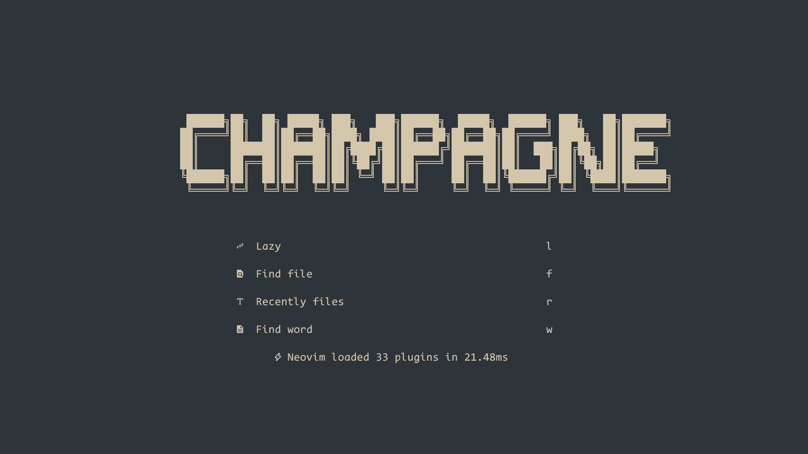
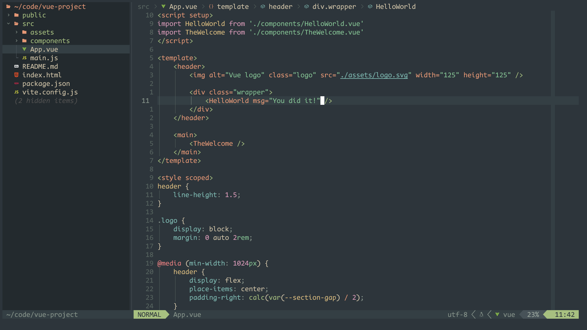

# My Neovim Config





#### 安装教程

- 您可以选择备份或删除您当前的 Neovim 文件：
```bash
# 需要
mv ~/.config/nvim ~/.config/nvim.bak

# 可选，但建议
mv ~/.local/share/nvim ~/.local/share/nvim.bak
mv ~/.local/state/nvim ~/.local/state/nvim.bak
mv ~/.cache/nvim ~/.cache/nvim.bak
```

```bash
# 需要
sudo rm -r ~/.config/nvim ~/.config/nvim.bak

# 可选，但建议
sudo rm -r ~/.local/share/nvim ~/.local/share/nvim.bak
sudo rm -r ~/.local/state/nvim ~/.local/state/nvim.bak
sudo rm -r ~/.cache/nvim ~/.cache/nvim.bak
```

- 克隆启动器
```bash
git clone https://gitee.com/chamm/neovim.git ~/.config/nvim
```

- 启动 Neovim
```bash
nvim
```
